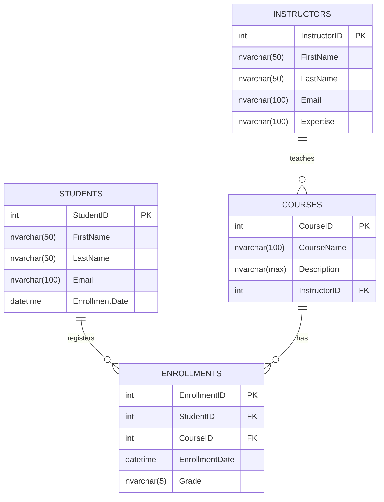

# E-Learning Platform Database (LearningDB)

A relational database system designed for managing an online learning platform (E-Learning). This database manages students, instructors, course offerings, and student enrollments with grading.

---

## 📌 Project Overview

- **Project Name:** E-Learning Platform Database
- **Database Name:** `LearningDB`
- **RDBMS Engine:** Microsoft SQL Server (T-SQL)
- **Author:** Eng. Osama Mohamed
- **Date:** June 17, 2026

---

## 🗂️ Database Schema

The database consists of 4 core relational tables:



### Tables Breakdown

1. **`Students`**
   - Stores student personal details and registration timestamps.
   - **Primary Key:** `StudentID` (`IDENTITY(1,1)`)
   - **Constraints:** `Email` is unique and non-null.

2. **`Instructors`**
   - Holds instructor profile information and areas of expertise.
   - **Primary Key:** `InstructorID` (`IDENTITY(1,1)`)
   - **Constraints:** `Email` is unique and non-null.

3. **`Courses`**
   - Catalogs available courses and links them to the assigned instructor.
   - **Primary Key:** `CourseID` (`IDENTITY(1,1)`)
   - **Foreign Key:** `InstructorID` references `Instructors(InstructorID)`.

4. **`Enrollments`**
   - Handles the many-to-many relationship between students and courses, storing enrollment timestamps and grades.
   - **Primary Key:** `EnrollmentID` (`IDENTITY(1,1)`)
   - **Foreign Keys:**
     - `StudentID` references `Students(StudentID)`
     - `CourseID` references `Courses(CourseID)`

---

## 🚀 Getting Started

### Prerequisites

- **Database Engine:** Microsoft SQL Server (2016 or later)
- **Management Client:** SQL Server Management Studio (SSMS), Azure Data Studio, or VS Code with the mssql extension.

### Execution

1. Open your SQL client and connect to your SQL Server instance.
2. Open the script file [`E-Learning-Project.sql`](file:///d:/Projects/E-Learning-Project.sql/E-Learning-Project.sql).
3. Execute the entire script (`F5` or **Execute**).
4. The script will automatically:
   - Create and switch to the `LearningDB` database.
   - Create all tables with constraints and foreign keys.
   - Insert sample seed data for instructors, courses, students, and enrollments.
   - Execute the final reporting query.

---

## 📊 Sample Reporting Query

The script includes a comprehensive join query to generate an enrollment and grading report:

```sql
SELECT 
    E.EnrollmentID AS [رقم التسجيل],
    S.FirstName + ' ' + S.LastName AS [اسم الطالب],
    C.CourseName AS [اسم الكورس],
    I.FirstName + ' ' + I.LastName AS [اسم المدرس],
    E.Grade AS [التقدير],
    E.EnrollmentDate AS [تاريخ التسجيل]
FROM Enrollments E
INNER JOIN Students S ON E.StudentID = S.StudentID
INNER JOIN Courses C ON E.CourseID = C.CourseID
INNER JOIN Instructors I ON C.InstructorID = I.InstructorID;
```
